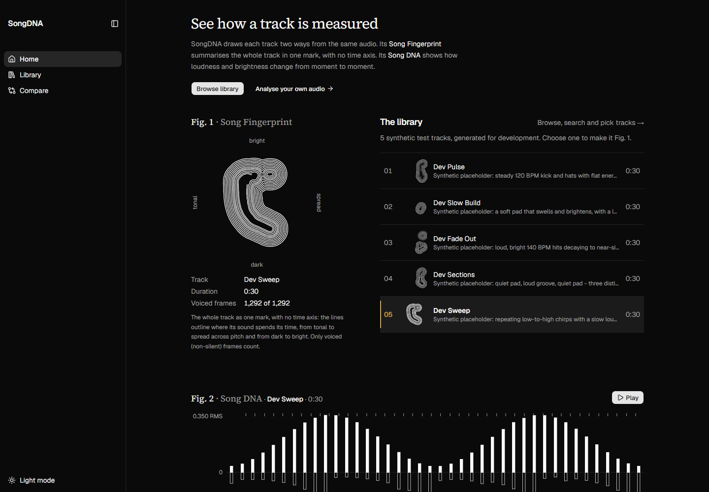
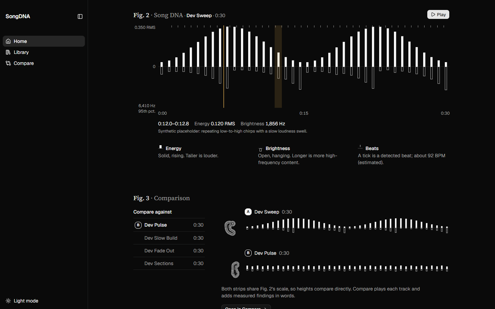
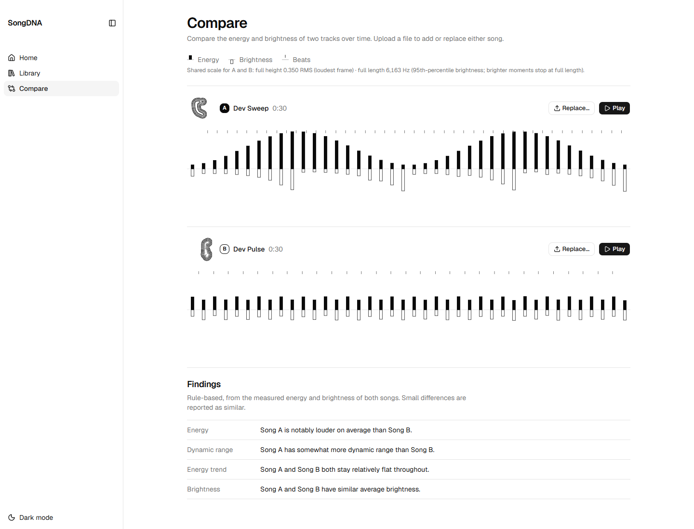
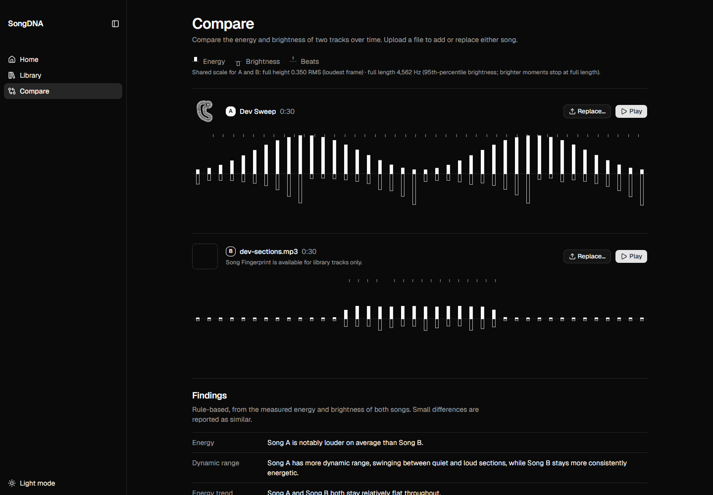

# SongDNA

**SongDNA measures songs and draws what it measured: a whole-track Song Fingerprint, a time-based Song DNA, and side-by-side comparison with findings you can trace back to the numbers.**

SongDNA is a local audio-analysis app built with Python (FastAPI, NumPy, librosa) and React. Every visual property maps to a real measurement: there is no machine learning, no similarity score and no guessing at genre or mood. Explore a small library of tracks, or analyse your own audio, and compare any two on one shared scale.

## What it does

| Layer | What it shows |
|---|---|
| **Song Fingerprint** | The whole track as one mark, with no time axis: where its sound spends its time, from tonal to spread across the 12 pitch classes and from dark to bright. An identity mark, not a unique identifier. |
| **Song DNA** | How the track changes over time: energy (loudness) as solid bars rising, brightness as open bars hanging, detected beats as ticks along the top. Playable, with a playhead. |
| **Comparison** | Two tracks on one shared scale, with four plain-language findings (energy, dynamic range, energy trend, brightness) produced by fixed, documented rules. |

The app has three pages: **Home** introduces both drawings through one library track, **Library** lets you browse, search, preview and pick two tracks, and **Compare** shows the pair with playback and findings.

## Screenshots


*Home, Fig. 1: Dev Sweep's Song Fingerprint beside the library index that chooses it.*


*Home, Fig. 2: Song DNA during playback. Pointing at a slice reads its measured energy and brightness.*


*Compare: two library tracks on a shared scale, with rule-based findings.*


*Compare with an upload: shown under its own file name, and honest that fingerprints are library-only.*

## How it works

**Song DNA** is measured from the audio, then simplified only for display.

- **Energy** is RMS loudness per frame (2048-sample frames, 512-sample hop, about 23 ms apart), written by hand in NumPy rather than taken from a library call.
- **Brightness** is the spectral centroid per frame (`librosa.feature.spectral_centroid`).
- **Beats** come from `librosa.beat.beat_track`, run on an 11,025 Hz copy for speed. Tempo is shown only as an estimate.
- **Display:** each series is averaged into 40 segments. The analysis data itself is never changed.
- **Shared scales:** songs that are compared share one ceiling. Energy uses the true maximum; brightness uses the 95th percentile, so a single bright transient can't flatten every other bar. Home uses one scale for the whole library; Compare uses one scale for the pair on screen. The actual ceilings are printed beside the charts.

**Song Fingerprint (version E1B1/1)** comes from a separate research study and is reproduced exactly.

- Every frame at or above −60 dBFS is placed by its chroma entropy (x: one pitch class → all twelve) and log spectral centroid (y: 50 Hz to 11,025 Hz).
- The frames form a blurred density, divided by the track's total frame count so that silence counts.
- The density is drawn as evenly spaced ridge lines: a 220 px hero and a separately traced 52 px thumbnail.
- All parameters are frozen and versioned. Fingerprints are generated for library tracks when the library is built; uploads don't get one.

**Findings** are deterministic. `POST /compare` compares the two songs' mean energy, energy spread, first-half versus second-half energy, and mean brightness. For the averages and the spread, differences under 10% are reported as "similar", 10–30% as "somewhat" and above that as "notably"; the trend counts as building or fading beyond ±15%. The thresholds and their reasoning are in [`src/song_dna/findings.py`](src/song_dna/findings.py).

## Engineering highlights

- **Research to production, verified bit for bit.** The fingerprint measurement and renderer were ported from the research code with the same arithmetic order. Parity tests compare the density (by a SHA-256 hash of its raw bytes), the frame counts and both rendered paths against a fixture produced by the research code itself. Each library build records its identity (parameter hash, corpus hash, reference density), and the frontend refuses fingerprint files from a different build.
- **Pair-safe async findings.** Each `/compare` response is stored with the exact A/B pair it answers and shown only while that pair is on screen. Each slot's loads are numbered, so a slow library load can't overwrite a newer upload. Replacing a song never leaves the previous pair's findings visible.
- **Honest, outlier-resistant visualisation.** Comparisons use shared scales so heights compare directly, with a percentile ceiling for brightness. Ceilings are labelled, and the display-only averaging never touches the measured data.
- **A CI guard against a real failure mode.** A past import bug passed the tests but broke the server, because pytest and uvicorn find the package from different roots. CI now boots the API exactly the way it's run and checks that it responds.
- **Accessible interactive chart.** Home's Song DNA works as a keyboard slider: arrow keys read slices, Enter moves playback there, and every reading is also available as text.
- **Clear error states.** "The analysis server isn't running" is reported separately from "this file couldn't be analysed". Server error details are never shown, and uploads keep the name of the file you chose.

## Tech stack

- **Backend:** Python 3.11, FastAPI, Uvicorn
- **Audio analysis:** NumPy, librosa, SciPy, soundfile
- **Frontend:** React 19, Vite, React Router, Tailwind CSS v4, shadcn/ui, hand-built SVG visualisations
- **Testing and CI:** pytest, Vitest, ESLint, GitHub Actions

## Testing and CI

- **Backend:** 115 pytest tests covering RMS, feature extraction, findings rules, the API, the library build, and the fingerprint measurement, renderer and research parity.
  - Five parity tests compare against the research output bit for bit, so they run only when the platform and library versions match the research environment and are skipped elsewhere.
- **Frontend:** 240 Vitest tests covering the pure logic (scaling, bucketing, layout, selection, Compare state and result pairing, request error handling, library and fingerprint loading).
- **CI** ([`.github/workflows/test.yml`](.github/workflows/test.yml)), on every pull request and push to `dev` and `main`:
  - backend tests;
  - a real server boot check;
  - frontend tests;
  - a production build.
- Lint runs locally.

## Running locally

Two servers run side by side: the FastAPI backend and the Vite frontend. Home and the Library work without the backend; uploads and Compare findings need it.

**Backend** (Python 3.11, from the repository root, in PowerShell):

```powershell
python -m venv venv
.\venv\Scripts\python.exe -m pip install -r requirements.txt
.\venv\Scripts\python.exe -m uvicorn song_dna.api:app --app-dir src --reload
.\venv\Scripts\python.exe -m pytest
```

The API runs at `http://127.0.0.1:8000`. Start it with `song_dna.api:app` and `--app-dir src`, not `src.song_dna.api:app`, which fails to import.

**Frontend** (Node 22, in a second terminal):

```powershell
cd frontend
npm ci
npm run dev        # http://localhost:5173
npm test
npm run lint
npm run build
```

The frontend calls the backend at `http://127.0.0.1:8000`; set `VITE_API_URL` to change it. See [`frontend/README.md`](frontend/README.md).

**Uploads** accept MP3, WAV, FLAC or OGG.

**Rebuilding the library.** The inputs are `frontend/public/library/metadata.json` and the audio in `frontend/public/library/audio/`. Everything else in that folder is generated, so don't edit it by hand. From the repository root:

```powershell
.\venv\Scripts\python.exe scripts\build_library.py         # features, fingerprints, library.json
.\venv\Scripts\python.exe scripts\generate_dev_tracks.py   # regenerate the synthetic audio (then rebuild)
```

Each build redraws every fingerprint from one shared reference density, so adding or changing a track can change the others.

## Current limitations

- **Local only:** single user, runs on localhost, with no deployment or accounts.
- **Synthetic library:** the five library tracks are synthetic test audio generated for development.
- **No persistence:** uploads are analysed fresh each time and lost on refresh, and uploaded files are never cleaned up from `data/audio/`.
- **No upload fingerprints:** only library tracks have a Song Fingerprint.
- **No overall similarity score**, and no time alignment between songs of different tempo or length.
- **Click-to-choose uploads:** the upload area looks like a dropzone, but drag and drop isn't wired up.
- **Independent playback:** A and B can play at the same time.
- **Limited error recovery:** there's no retry button, and a failed replacement upload clears that slot.
- **Unit tests only on the frontend:** pure logic is tested; rendering and the upload flow were verified by hand in a browser.

## Development process

SongDNA was built in small steps: one branch and one pull request per change, merged into `dev`, with CI running on every pull request.

AI coding tools were used inside a controlled workflow:
- shared agent instructions ([`AGENTS.md`](AGENTS.md)) set the product rules and verification steps;
- branches, commits and merges stayed manual;
- UI changes were checked in a real browser;
- the Song Fingerprint port got an independent review before merging;
- CI checks ran on every pull request.

[`PROJECT_CONTEXT.md`](PROJECT_CONTEXT.md) holds the original concept and longer-term ideas; [`PRODUCT.md`](PRODUCT.md) holds the product and design commitments.

### AI tooling setup

`CLAUDE.md` imports `AGENTS.md` and adds Claude Code specifics. Project permissions are in `.claude/settings.json`. `/feature <request>` runs the project's feature workflow (`.claude/skills/feature/`): plan, implement, test, verify in a browser, self-review and report. It never stages, commits, pushes or opens pull requests.

The installed agent skills (`impeccable`, `playwright-cli`, `gh-fix-ci`) are git-ignored; `skills-lock.json` records where each came from. Restore them with:

```powershell
npx skills experimental_install
```

`skills-lock.json` stores a source and a content hash, not a pinned revision, so a restore may fetch a newer copy. `playwright-cli` also needs the CLI itself (`npm install -g @playwright/cli`, developed against 0.1.21).

## License

[MIT](LICENSE)
